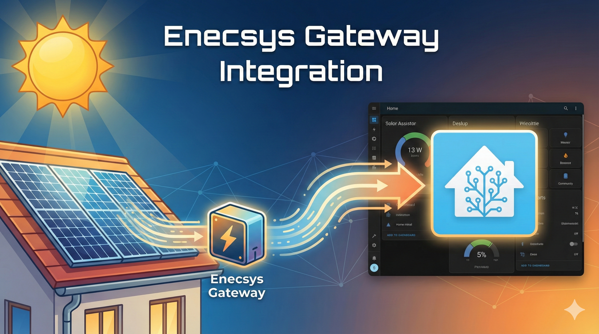
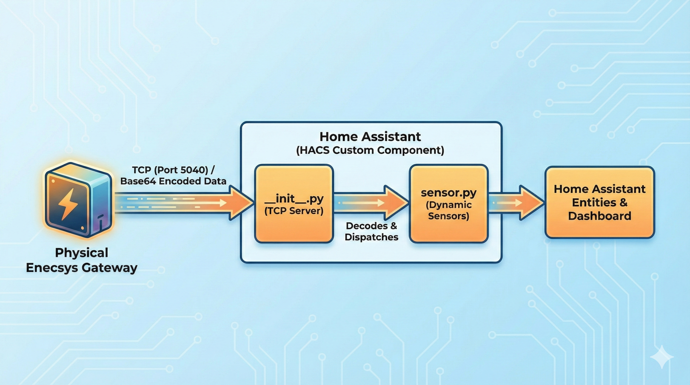

# Enecsys Gateway Integration

 

A local-only Home Assistant integration that acts as a "resurrection" server for the defunct **Enecsys Gen 1 Gateway**. It listens for incoming data and automatically creates sensors for your solar inverters.

## ℹ️ How it Works

This integration runs a lightweight TCP server inside Home Assistant that emulates the old Enecsys cloud. Your physical gateway sends its data to this server, which decodes the proprietary format and updates Home Assistant sensors in real-time.

## 📥 Installation (HACS)

1.  Open **HACS** > **Integrations**.
2.  Click the menu (3 dots) > **Custom repositories**.
3.  Add the URL: `https://github.com/lifeandfate1/enecsys-gateway`
4.  Category: **Integration**.
5.  Click **Add** then **Download**.
6.  Restart Home Assistant.

## ⚙️ Configuration

1.  Add the following line to your `configuration.yaml` file to enable the integration:

@@@yaml
enecsys_gateway:
@@@

2.  **Restart Home Assistant again** to start the TCP listener.

## 🔌 Hardware Setup (Physical Gateway)

You must redirect your physical Enecsys Gateway to talk to your Home Assistant IP address instead of the dead Enecsys servers.

1.  Find your **Home Assistant IP address**.
2.  Log into your **Enecsys Gateway** web interface (default: `admin`/`password`).
3.  Navigate to **Connection Settings** (or Remote Server).
4.  Set the **Server URL** to your Home Assistant IP.
5.  Set the **Port** to `5040`.
6.  **Save and Reboot** the Gateway.

Sensors (e.g., `sensor.enecsys_12345_power`) will appear automatically in Home Assistant as soon as the Gateway sends its first packet of data.